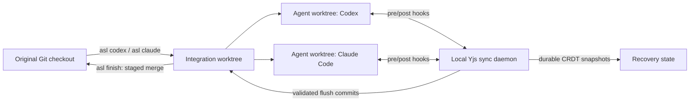

# Agent Sync Layer (ASL)

**Real-time CRDT synchronization for concurrent AI coding agents. Run Codex and Claude Code in parallel without silently losing overlapping file edits.**

Agent Sync Layer (`asl`) combines [Yjs](https://yjs.dev/) collaborative editing, Git worktree isolation, durable recovery, and coding-agent hooks. Each agent works in its own Git worktree while accepted text changes converge through a local synchronization daemon and are collected on an integration branch for review.

Use it when you want multiple coding agents working on the same repository at the same time—with explicit conflict handling instead of last-write-wins file overwrites.

## Why Agent Sync Layer?

Running multiple coding agents in one checkout is unsafe: they can overwrite each other's files, observe half-finished changes, or leave the repository in an inconsistent state. Giving every agent a separate Git worktree prevents direct filesystem collisions, but it does not share in-progress edits.

ASL provides both:

- **Isolated workspaces** — one Git worktree and branch per agent.
- **Live text synchronization** — Yjs CRDT rooms merge independent changes as they happen.
- **Conflict rejection** — stale or ambiguous edits fail with an actionable “re-read and retry” error instead of guessing.
- **Crash recovery** — acknowledged CRDT state is persisted before the write reports success.
- **Safe integration** — accepted changes flush to an integration branch and reach your original checkout as a staged, uncommitted merge.
- **Codex and Claude Code support** — managed hook injection through `asl codex` and `asl claude`.
- **Extensible adapters** — a generic MCP proxy, an SDK, and an experimental FUSE adapter.


## Quick start


### 1. Install

With Node.js 20.12 or newer:

```bash
npm install --global agent-sync-layer
```

Or download the standalone archive for your operating system from [GitHub Releases](https://github.com/alanoconner/agent-sync-protocol/releases/latest). Standalone builds include Node.js; Git and the coding-agent CLI are still required.

See the [installation guide](docs/installation.md) for macOS, Linux, Windows, checksum verification, upgrades, and source installation.

### 2. Start an agent

Run ASL from a clean Git checkout:

```bash
asl codex
```

Or:

```bash
asl claude
```

Run the command again in another terminal to add another synchronized agent:

```bash
asl codex --name reviewer
asl claude --name implementer
```

On the first Codex launch, ASL asks you to open `/hooks` and trust its stable project hook definition. Codex does not run untrusted hooks automatically; review the command before approving it. See the official OpenAI documentation for [hook packaging and trust behavior](https://developers.openai.com/plugins/build/plugins#bundled-mcp-servers-and-lifecycle-hooks).

### 3. Inspect and finish

```bash
asl status
asl finish
```

`asl finish` flushes synchronized changes, runs configured validation, stops the daemon, compacts recovery commits, and prepares an uncommitted merge in your original checkout. Review it normally:

```bash
git status
git diff --cached
git commit
```

Read [Your first synchronized session](docs/getting-started.md) for the complete walkthrough.

## How it works




Each shared text file is represented by a Yjs document. Before a covered tool operates, the hook refreshes the agent worktree from current shared state. After a write, ASL compares the tool's before/after snapshot with the live document:

- Non-overlapping changes merge.
- Stale overlapping changes reject.
- Ambiguous replacements reject.
- Deletions synchronize through tombstones.
- Declared exclusive files use a short server-arbitrated lease.

The original checkout is not edited during the session. Git refs and managed worktrees are created, while the integration branch receives granular recovery commits.

## Requirements

- Git on `PATH` with `user.name` and `user.email` configured.
- A clean, non-bare Git checkout on a branch.
- Codex CLI or Claude Code on `PATH`, depending on the command you run.
- Node.js 20.12+ for npm installation; not required for standalone builds.
- Git for Windows for native Windows use.
- macFUSE or libfuse only when using the optional experimental FUSE adapter.


## Common commands


| Command         | What it does                                                       |
| --------------- | ------------------------------------------------------------------ |
| `asl codex`     | Starts Codex in a new synchronized worktree.                       |
| `asl claude`    | Starts Claude Code in a new synchronized worktree.                 |
| `asl status`    | Shows the session, daemon, integration branch, and agents.         |
| `asl stop`      | Flushes and pauses while retaining managed worktrees.              |
| `asl finish`    | Validates and prepares a staged merge in the original checkout.    |
| `asl clean`     | Removes safe agent worktrees but retains the integration branch.   |
| `asl reset`     | Destructively discards the managed session and its unmatched work. |
| `asl dashboard` | Displays active shared files, peers, and exclusive locks.          |
| `asl init`      | Creates `.agent-sync.yml` with documented defaults.                |
| `asl recover`   | Resolves a disk-versus-CRDT recovery conflict explicitly.          |


The [CLI reference](docs/asl-cli.md) documents every option, lifecycle transition, safety check, and recovery command.

## Configuration

Create a project configuration:

```bash
asl init
```

The generated `.agent-sync.yml` looks like this:

```yaml
server: ws://localhost:4600

paths:
  exclusive: []
  ignore:
    - "node_modules/**"
    - "dist/**"

line_endings: lf

flush:
  debounce_ms: 3000

worktrees:
  auto_install: true
  # setup_command: "npm ci"

# validation:
#   command: "npm run typecheck && npm test"
#   on_fail: reject_merge

symbol_index:
  enabled: false
  language: typescript
  enforcement: advisory
```

Important settings:

- `paths.exclusive` routes lockfiles, generated schemas, or other unsafe-to-merge files through a short exclusive lease.
- `paths.ignore` excludes matching files from hook workspace scans.
- `worktrees.auto_install` detects npm, pnpm, Yarn, or Bun lockfiles and installs dependencies in new managed worktrees.
- `worktrees.setup_command` overrides automatic setup. ASL displays repository-defined commands and asks for trust before first execution.
- `validation.command` runs before synchronized disk changes are committed. `reject_merge` restores disk state on failure; `warn_only` commits with a warning.
- `symbol_index` is reserved for a future phase and is not implemented.


## Session lifecycle

A typical workflow is:

```text
asl codex / asl claude
        │
        ▼
     active ── asl stop ──► paused
        │                     │
        │                     └── asl codex / asl claude ──► active
        │
        └── asl finish ──► staged merge in original checkout
```

Use `asl clean` after finishing when you want to remove safe agent worktrees. Use `asl reset` only when you intentionally want to discard the entire managed session. Reset is destructive and is not an alias for ordinary cleanup.

## What ASL guarantees

- Acknowledged repository-backed writes have a durable CRDT snapshot.
- Covered text-file changes do not silently overwrite a stale overlapping edit.
- The sync daemon and control API bind to loopback by default.
- Validation failures can restore the exact pre-flush disk bytes.
- Flush commits stage only their literal target path.
- `asl finish` refuses a dirty, moved, detached, or otherwise unsafe original checkout.
- `asl clean` refuses to remove worktree changes that do not match integration state.


## Current limitations

- Hooks synchronize text files up to 1 MB and at most 200 changed files per tool call.
- Binary files and processes that keep writing after a tool call returns are outside hook coverage.
- A room hydrates from disk once. External edits made behind the daemon's back are not reconciled until restart.
- Hook processes are short-lived, so dashboard presence is less continuous than persistent SDK clients.
- The FUSE adapter is experimental: it has no `readdir`, `mkdir`, or `rename`, and no WinFsp implementation.
- Phase 8's symbol/dependency index is not implemented.
- Standalone macOS and Windows binaries are not yet trusted-publisher signed.

These boundaries are expanded in the [CLI reference](docs/asl-cli.md#safety-checks-and-limitations).

## Library and integration APIs

The npm package also exposes an ESM SDK:

```ts
import { SyncFileOps } from "agent-sync-layer";

const files = new SyncFileOps({ serverUrl: "ws://localhost:4600" });

const before = await files.readFile("src/example.ts");
await files.writeFileFromSnapshot(
  "src/example.ts",
  before,
  before.replace("oldValue", "newValue"),
);

await files.close();
```

Published entry points:

- `agent-sync-layer` — `SyncClient`, `SyncFileOps`, and synchronization errors.
- `agent-sync-layer/config` — `.agent-sync.yml` parsing and defaults.
- `agent-sync-layer/server` — server/runtime construction.
- `agent-sync-layer/mcp` — generic MCP filesystem-tool proxy.
- `agent-sync-layer/fuse` — experimental FUSE operations and mount adapter.

For adapter design and protocol details, see [CLAUDE.md](CLAUDE.md) and [agent-sync-dev-spec.md](agent-sync-dev-spec.md).

## Development

```bash
npm ci
npm run typecheck
npm run typecheck:examples
npm test
npm run build
```

Useful focused commands:

```bash
npx vitest run test/convergence.test.ts
npm run cli -- status
```

See [CONTRIBUTING.md](CONTRIBUTING.md) for repository layout, test expectations, and pull-request guidance.

## Documentation

- [Installation](docs/installation.md)
- [Your first synchronized session](docs/getting-started.md)
- [Complete CLI reference](docs/asl-cli.md)
- [Maintainer release guide](docs/distribution.md)
- [Development specification](agent-sync-dev-spec.md)
- [Implementation history](CHANGELOG.md)
- [Security policy](SECURITY.md)


## Project status

Phases 1–7 of the development specification are implemented: CRDT sync, multi-file presence, transparent interception, disk/Git persistence, validation, exclusive locks, configuration, and managed agent sessions. Phase 8, the optional symbol/dependency index, has not started. Packaging exists for npm plus Linux x64, Windows x64, macOS x64, and macOS ARM64 standalone executables.

## License

See [LICENSE](LICENSE).